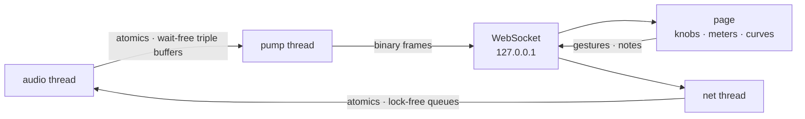

# vst3-web-stratum

**Build your audio plug-in's UI with web technology, without paying for it
in latency, weight or real-time safety.** vst3-web-stratum is a Rust
framework: the DSP stays in Rust, the window is the operating system's own
web view, and a local binary WebSocket bridge moves parameters, gestures,
notes and telemetry between them in tens of microseconds.



## Why

Plug-in interfaces are where audio developers lose the most time. The
native toolkits are small worlds of their own: custom widget sets, custom
layout, custom text rendering, custom DPI handling, and a design workflow
that no designer already knows. Every knob, meter and analyzer is written
from scratch, and every product ends up with its own half-finished UI
framework.

Meanwhile the browser engine on every machine is the most capable, best
tooled, most documented rendering stack there is: CSS layout, GPU
compositing, canvas and WebGL, hot reload, devtools, a designer-friendly
pipeline, and a labour market of people who can build with it. The reasons
plug-ins have not used it are practical, not fundamental: shipping a
browser engine per plug-in is absurd, JSON-over-HTTP is far too slow for a
knob, and nobody wants a web page anywhere near an audio callback.

vst3-web-stratum removes those three obstacles and nothing else:

* **No bundled engine.** The plug-in window hosts the OS web view (WebView2
  on Windows, WKWebView on macOS, WebKitGTK on Linux) through `wry`. A
  plug-in gains a few hundred kilobytes, not a hundred megabytes.
* **A wire format built for knobs and meters.** Fixed-layout little-endian
  frames over a loopback WebSocket with Nagle disabled. A parameter edit is
  12 bytes; a 1025-bin spectrum lands in the page as a `Float32Array` view
  with no copy and no parsing. Measured edit-to-echo round trip: about 30 µs
  median, under 150 µs at the 99th percentile, with 386 parameters and eight
  telemetry streams live.
* **Real-time safety by construction.** The audio thread only ever touches
  atomics, wait-free triple buffers and lock-free queues. It never
  allocates, never locks, never waits for the page. A slow, hidden or closed
  page costs it nothing; telemetry is "latest wins", parameter values and
  events are never dropped silently.

## What you get

* **The page is just a page.** Use Vue, React, Svelte, d3, plain canvas or
  WebGL. Develop it in a normal browser tab against the running plug-in with
  hot reload, inspect it with devtools, and hand it to a designer who has
  never opened a DAW.
* **A complete client library.** `@elyerinfox/vst3-web-stratum` gives you
  parameter handles that know their range, taper, unit and formatting;
  streams; events; a plug-in-persisted key-value store; undo, redo and A/B;
  and dependency-free canvas components (knob, meter, spectrum analyzer, EQ
  curve with draggable nodes, oscilloscope, keyboard, wavetable view, ADSR
  editor). A Vue 3 layer wraps them in composables and components.
* **Host-correct behaviour for free.** Edits carry begin / perform / end so
  automation records properly; the nih-plug adapter forwards them on the GUI
  thread, mirrors every host parameter with a 65-point table so the page
  scales and formats it exactly, handles resize, and saves page state (user
  presets, favourites, view settings) inside the plug-in state, where it
  belongs.
* **Many instances, no collisions.** Each instance probes its own port range
  derived from the plug-in name, publishes a discovery record, and answers
  `/instances` for its siblings. Several windows of one instance share
  state; a second copy of a standalone just takes the next port.
* **Testable from a shell.** Every plug-in is also a server: `node
  tools/bench.mjs` measures latency, `tools/setparam.mjs` sets a parameter,
  `tools/play.mjs` plays a note and checks the meter, `tools/instances.mjs`
  lists what is running. Headless UI checks are a browser screenshot away.
* **Small, generic, documented.** The framework knows nothing about EQs or
  synths. Two complete examples show what a product built on it looks like:
  a 24-band Pro-Q style EQ and a wavetable synth, each with DSP, a VST3/CLAP
  plug-in, a standalone with real audio and a Vue + Tailwind interface.

## What it costs

Be clear-eyed about the trade-offs:

* The first frame of the UI arrives after the web view starts, which is
  slower than a native window (hundreds of milliseconds, once per editor
  open). Parameter changes from then on are microseconds.
* The OS web view is what it is: Windows 10 needs the WebView2 runtime
  installed, Linux needs WebKitGTK, and the three engines differ in small
  ways. When no web view is available the same page opens in the system
  browser.
* The server binds localhost without authentication; anything running as
  the same user can talk to it. That is the same trust level as the plug-in
  process itself, and it is what makes the browser-tab workflow possible.
* Rendering happens in the web view's process budget, not yours. A page that
  draws 60 frames per second of analyzer costs what a browser tab costs.

## Measured

Release build, loopback, Noob-Q with 24 bands and 386 parameters, all eight
telemetry streams flowing (`node tools/bench.mjs 4242`, 2000 samples):

| path | p50 | p99 |
|---|---|---|
| knob edit → applied to the DSP → echoed back to the page | 32 µs | 148 µs |
| ping round trip | 30 µs | 159 µs |

Spectra at 94 frames/s, meters at block rate, all delivered with under half
a millisecond of jitter. Details and tuning in
[docs/PERFORMANCE.md](docs/PERFORMANCE.md).

## Layout

Framework (published as **elyerinfox**):

| path | what it is |
|---|---|
| `crates/vst3-web-stratum` | The bridge and server: wire protocol, parameter store, stream mailboxes, event queues, discovery, the UI store. No plug-in-framework dependency. Ships the browser client in `web/`. |
| `crates/vst3-web-stratum/web` | `@elyerinfox/vst3-web-stratum`: the browser client (ESM, zero dependencies), the canvas components, undo/redo/A-B, and the optional Vue 3 layer (`/vue`). |
| `crates/vst3-web-stratum-nih` | The `nih-plug` `Editor` adapter: parameter mirroring, GUI-thread gesture forwarding, the embedded web view, resize, `StoreSlot` persistence. |
| `crates/vst3-web-stratum-webview` | The OS web view (WebView2 / WKWebView / WebKitGTK via `wry`) as a child of a host window, plus a native UI-thread timer. |

Examples (never published; `publish = false`, npm `private`). I wrote them
as humorous, affectionate spoofs of products I admire, to exercise the
framework at product size; neither aims at parity with, or replacement of,
the originals that inspired it:

| path | what it is |
|---|---|
| `examples/noob-q` | **Noob-Q**, a Pro-Q style 24-band EQ: Rust DSP, nih-plug VST3/CLAP effect with side-chain, standalone dev server, Vue + Tailwind SPA. Feature coverage in [docs/FEATURES.md](docs/FEATURES.md). |
| `examples/noob-wave` | **Noob-Wave**, a wavetable synth: mipmapped tables, unison, sub, SVF filter, two ADSRs, LFO, 16 voices; nih-plug VST3/CLAP instrument with MIDI; standalone with real audio output; Vue + Tailwind SPA with an on-screen keyboard. |

Plus `docs/` (the guides), `tools/` (the Node scripts) and `.github/workflows/`
(CI and the docs site).

## Run the examples without a DAW

```sh
# Noob-Q (EQ): visual only, port 4242 (or the next free one; --port N insists)
cd examples/noob-q/web && npm install && npm run build && cd ../../..
cargo run -p noob-q --bin noob-q-standalone -- --open

# Noob-Wave (synth): plays through your default audio device, port 4243 (or the next free one)
cd examples/noob-wave/web && npm install && npm run build && cd ../../..
cargo run -p noob-wave --bin noob-wave-standalone -- --open
# then play the on-screen keyboard, or the A W S E D F … keys

# measure either one
node tools/bench.mjs 4243
node tools/play.mjs 4243 60

# what is running (both, plus any plug-in instance in a DAW)
node tools/instances.mjs
```

Run either standalone twice and the second copy takes the next port; user
presets saved in one window show up in every window of that instance.

During UI development run `VST3_WEB_STRATUM_PORT=<port> npm run dev` in the example's
`web/` folder and open the Vite URL; it proxies `/ws` and `/instance*` to
the running standalone.

## Build the plug-ins

The `plugin` feature pulls `nih-plug` from git and embeds the example's
`web/dist`, so build the SPA first.

```sh
cd examples/noob-wave/web && npm run build && cd ../../..
cargo build -p noob-wave --features plugin --release   # → target/release/noob_wave.dll
cargo build -p noob-q    --features plugin --release   # → target/release/noob_q.dll
```

Wrap them into `.vst3` / `.clap` bundles with nih-plug's bundler
(`cargo install --git https://github.com/robbert-vdh/nih-plug.git nih_plug_xtask`,
then `cargo xtask bundle noob-wave --features plugin --release`). Opening the
editor in a host embeds WebView2 (Windows) or WKWebView (macOS) in the plug-in
window; on Linux, or if the web view cannot be created, the same page opens in
the system browser instead.

## Use it in your own plug-in

```rust
use vst3_web_stratum::{Vst3WebStratum, ParamSpec, StreamSpec, StreamKind, ServerConfig, event_kind};

let bridge = Vst3WebStratum::builder("MyPlugin")
    .param(ParamSpec::new("cutoff", "Cutoff").range(20.0, 20000.0).log().default(1000.0).unit("Hz"))
    .stream(StreamSpec::new("meter", 2).kind(StreamKind::Meter).channels(2))
    .stream(StreamSpec::new("curve", 256).kind(StreamKind::Curve).sticky())  // replayed to late clients
    .build();

// audio thread: never allocates, locks or blocks
let mut audio = bridge.take_audio().unwrap();
let cutoff = audio.param(0);
audio.drain_events(|e| if e.kind == event_kind::NOTE_ON { /* note e.a, velocity e.value */ });
audio.publish_slice(0, &[peak_l, peak_r]);

// anywhere else
let server = vst3_web_stratum::serve(&bridge, ServerConfig::default().assets_dir("ui/dist"))?;
println!("{}", server.url());
```

With nih-plug, `vst3_web_stratum_nih::Vst3WebStratumEditor::new(name, &params, streams, EditorConfig::new(w, h))`
does the mirroring, the server, the web view and the gesture forwarding; see
`examples/noob-wave/src/plugin.rs` (instrument with MIDI) and
`examples/noob-q/src/plugin.rs` (effect with side-chain).

In the page:

```js
import { Vst3WebStratumClient, History } from '@elyerinfox/vst3-web-stratum';
import { Knob, Spectrum, EqCurve, Keyboard, WavetableView, Envelope } from '@elyerinfox/vst3-web-stratum/components';

const client = await Vst3WebStratumClient.connect();      // ws://<host>/ws
const cutoff = client.param('cutoff');
cutoff.on((v) => console.log(cutoff.plain));       // host automation, other UIs
cutoff.beginEdit(); cutoff.set(0.5); cutoff.endEdit();
client.stream('meter').on((data) => draw(data));   // Float32Array, zero-copy
client.noteOn(60, 0.8); client.noteOff(60);        // events to the audio thread
client.on('event', (e) => lightKey(e));            // events from the plug-in
client.store.set('presets.user', list);            // travels with the plug-in state
new Keyboard(el, client);                          // mouse, touch, QWERTY
new History(client);                               // Ctrl+Z material
```

With Vue:

```js
import { useVst3WebStratum, useParam, Knob, Popover, ContextMenu, LevelMeter } from '@elyerinfox/vst3-web-stratum/vue';
const { ready } = useVst3WebStratum();
const cutoff = useParam('cutoff');   // reactive: cutoff.plain, cutoff.text, cutoff.set(n)
```

Any framework works on top of this: `Param` and `Stream` are plain objects
with `on()`. The framework crates and the browser package know nothing about
any particular product; everything product specific lives in the examples.
[docs/GETTING-STARTED.md](docs/GETTING-STARTED.md) walks through a complete
plug-in.

## Documentation

Start at [`docs/README.md`](docs/README.md), the index. The main entries:

| | |
|---|---|
| [Getting started](docs/GETTING-STARTED.md) | Build a plug-in with a browser UI end to end: DSP, standalone, page, nih-plug plug-in. |
| [Architecture](docs/ARCHITECTURE.md) | Crates, threads, data model, the real-time contract, latency budget, design decisions. |
| [Rust API tour](docs/RUST-API.md) | `vst3-web-stratum`, `vst3-web-stratum-nih`, `vst3-web-stratum-webview` at a glance; rustdoc has the rest (`cargo doc --open`). |
| [Browser API](crates/vst3-web-stratum/web/README.md) | `@elyerinfox/vst3-web-stratum`: client, parameters, streams, store, history, Vue layer; [components](crates/vst3-web-stratum/web/components/README.md). |
| [Wire format](docs/WIRE.md) | Every frame, byte by byte. |
| [Multiple instances](docs/MULTI-INSTANCE.md) | Ports, discovery, the UI store. |
| [Performance](docs/PERFORMANCE.md) | Numbers, methodology, tuning. |
| [Tools](docs/TOOLS.md) | The `tools/` scripts. |
| [Development](docs/DEVELOPMENT.md) | Working on this repository; CI; quirks. |
| [Troubleshooting](docs/TROUBLESHOOTING.md) | When something does not work. |
| Examples | [Noob-Q](examples/noob-q/README.md) and its [SPA](examples/noob-q/web/README.md); [Noob-Wave](examples/noob-wave/README.md) and its [SPA](examples/noob-wave/web/README.md); [feature coverage](docs/FEATURES.md). |

The Rust API documentation of the framework crates is published to GitHub
Pages by the docs workflow on every push to `main`. Changes are tracked in
[`CHANGELOG.md`](CHANGELOG.md).

## Design notes

* **Binary, not protobuf.** Telemetry is arrays of `f32` at up to audio-block
  rate; a fixed little-endian layout lets the browser wrap them in a
  `Float32Array` without copying. JSON is used only for the one-time manifest
  and ad-hoc messages. See `docs/WIRE.md`.
* **Latest wins**, except where it must not. Streams go through wait-free
  triple buffers, so a slow UI drops frames rather than building a backlog;
  sticky streams keep their last frame for late clients; events and
  parameter values are never dropped silently (a full client queue forces a
  full resync).
* **The audio thread wakes the network thread** with one `unpark` (an atomic
  swap plus a light wake syscall only if the pump is actually asleep). Set
  `WakeMode::Poll` if your real-time policy forbids that.
* **TCP_NODELAY** is on; Nagle alone would cost up to 40 ms per 12-byte edit.
* **Gestures, not values.** Edits carry begin / perform / end so hosts record
  automation correctly; the adapter forwards them from the UI thread.
* **Parameters are mirrored as 65-point tables**, so the page can format and
  scale any range a plug-in framework defines without knowing its formula.
* **Many instances, no collisions.** Every server probes a port range
  (plug-ins: one derived from the plug-in name; standalones: upward from
  their documented port) and publishes a discovery record; `/instances` lists
  the other instances of the same plug-in. Page state that should travel
  with the plug-in (presets, favourites, view settings) goes in the UI store
  (`client.store`): the nih-plug adapter saves it in the host's plug-in
  state, standalones keep it in a file, and every window of an instance sees
  the same values. The browser's own storage is left for per-machine
  conveniences.

## Status

Version 0.1.0. Everything builds with zero warnings under `clippy -D
warnings`; 71 Rust tests pass (core wire / real-time / bridge unit tests,
eight socket-level integration tests covering the round trip, events, sticky
streams, port probing, the UI store, discovery, instance scoping and several
clients at once, 14 EQ DSP tests, 11 synth DSP tests, and the doctests).
Both plug-ins compile-check with their `plugin` feature but have not yet
been run inside a host. The synth standalone has been verified end to end on
real hardware: a note sent from the page produces sound on the default
output device and releases cleanly. Linux and macOS builds of the web view
are written against `wry` but have only been exercised on Windows.

## License

Licensed under either of [Apache License, Version 2.0](LICENSE-APACHE) or
[MIT license](LICENSE-MIT) at your option. Unless you explicitly state
otherwise, any contribution intentionally submitted for inclusion in the work
by you shall be dual licensed as above, without any additional terms or
conditions.
