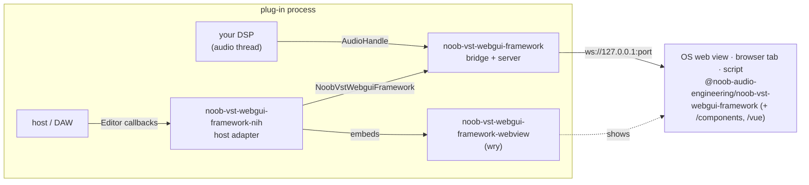
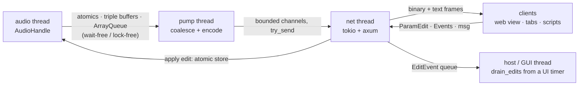
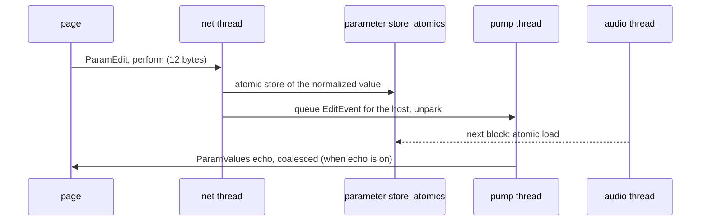

# Architecture

noob-vst-webgui-framework lets an audio plug-in render its user interface in a browser engine
without giving up the latency of a native UI. This document explains the
pieces, the threads, the data model, the real-time rules, and the reasoning
behind the main decisions. Read [GETTING-STARTED.md](GETTING-STARTED.md)
first if you want to build something; read this when you want to know why
it works.

## Goal and constraints

* A plug-in (VST3 or CLAP through nih-plug, or anything else that can host a
  Rust library) exposes **parameters** and **telemetry** to a page, and the
  page sends **edits** and **events** back.
* Control latency must be in the tens of microseconds on the wire, not the
  tens of milliseconds a JSON-over-HTTP design would give. Measured numbers
  are in [PERFORMANCE.md](PERFORMANCE.md).
* The audio thread never blocks, never allocates, and never waits for the
  UI. A slow or disconnected page costs the audio thread nothing.
* Only the operating system's web view is used (WebView2, WKWebView,
  WebKitGTK). No browser engine is bundled.
* Everything generic lives in the framework crates and the browser library;
  everything product specific lives in the plug-ins, each in its own repository.

## The pieces

| Piece | Language | Role |
|---|---|---|
| `crates/noob-vst-webgui-framework` | Rust | The bridge (`NoobVstWebguiFramework`, `AudioHandle`), the parameter store, stream mailboxes, the wire codec, the WebSocket/HTTP server, discovery, the UI store. Feature `server` (default) pulls in tokio and axum; without it the crate is the protocol and the real-time queues only. |
| `crates/noob-vst-webgui-framework-nih` | Rust | An `nih_plug::Editor` whose window is the OS web view showing the page the plug-in serves. Mirrors nih-plug parameters, forwards gestures on the GUI thread, persists the UI store in plug-in state. |
| `crates/noob-vst-webgui-framework-webview` | Rust | A thin wrapper over `wry`: embed a web view as a child of a host-provided window handle, plus a native UI-thread timer. |
| `crates/noob-vst-webgui-framework/web/` (`@noob-audio-engineering/noob-vst-webgui-framework`) | JavaScript | The browser client: connect, decode binary frames, parameter handles with tapers and gestures, streams, events, the store, undo history. `@noob-audio-engineering/noob-vst-webgui-framework/components` are dependency-free canvas widgets; `@noob-audio-engineering/noob-vst-webgui-framework/vue` is a Vue 3 layer. |
| [noob-q](https://github.com/Noob-Audio-Engineering/noob-q), [noob-wave](https://github.com/Noob-Audio-Engineering/noob-wave), [noob-compressorlab](https://github.com/Noob-Audio-Engineering/noob-compressorlab) | Rust + Vue | The free plug-ins built on the framework, in their own repositories: a 24-band EQ, a wavetable synth and a two-model compressor, each with DSP, a plug-in, a standalone dev binary and a Vue + Tailwind SPA. |
| `tools/` | Node | Latency bench, parameter setter, note player, instance lister. |

## Data model

### Parameters

A parameter is declared once with a `ParamSpec`: id, display name, range,
default, unit, group, taper (linear, log, skew, or an explicit 65-point
table), step count, labels for discrete values, automatable flag. On the wire
and in the store every parameter is a **normalized** `f32` in `0..1`;
conversion to and from the **plain** value happens at the edges (the page for
display, the plug-in for DSP). The manifest always includes a 65-point table
of the normalized to plain mapping, so a page can draw a correct scale for a
parameter whose formula it does not know. That is how nih-plug parameters are
mirrored without reimplementing nih-plug's ranges in JavaScript.

Parameters flow in both directions:

* **Plug-in to page**: the host changed a value (automation, another window),
  or the plug-in itself did. The change is queued for the pump thread, which
  coalesces per parameter and sends a `ParamValues` frame to every client.
  Values are also readable at any time by the audio thread through atomics.
* **Page to plug-in**: the page sends a `ParamEdit` frame with a gesture
  phase (begin, perform, end). The net thread applies it to the store
  immediately, so the audio thread sees it on its next block, and queues an
  `EditEvent` for the host side, which forwards it to the DAW with the right
  begin/end bracketing for automation recording.

### Streams

A stream is a named channel of `f32` frames published by the audio thread:
spectra, meters, waveforms, response curves, voice states, anything. Each has
a capacity, a kind (a hint for the page: spectrum, meter, waveform, raw), a
channel count and free-form metadata (sample rate, FFT size, layout).

Streams are **latest wins**. The audio thread writes into a wait-free triple
buffer; the pump thread takes the newest frame and sends it. If the network
is behind, intermediate frames are dropped, never queued, so a stalled page
cannot build a backlog that would later replay. Frame sequence numbers make
the gaps visible. A **sticky** stream additionally keeps its last frame on the
server and replays it to clients that connect later, which is how state-like
data that is only published on change (a response curve, a wavetable) is
present immediately.

Clients subscribe per stream with an optional interval, so a hidden panel can
switch its stream off or down to a few frames per second without affecting
other clients.

### Events

Events are small fixed-size records (kind, channel, two bytes, a float, a
sample offset) carried in both directions in `Events` and `EventsOut` frames.
Noob-Wave uses them for notes from the on-screen keyboard and for
lighting keys when the host plays. They are queued in lock-free queues and
never dropped silently: a full queue is reported to the sender.

### Messages

JSON text frames `{ "t": "msg", "topic", "data" }` carry everything that is
not hot: a preset name, a status report, a resize request. They are cheap to
add and cost nothing on the fast path because they never share a frame with
binary data.

### The UI store

A small JSON object owned by the plug-in for page state that should travel
with the plug-in rather than with the browser profile: user presets,
favourites, view settings. It is hydrated on connect, changes fan out to the
other clients, and the host adapter saves it inside the plug-in state.
Standalones keep it in a file. Details in
[MULTI-INSTANCE.md](MULTI-INSTANCE.md#the-ui-store).

## Threads

**Audio thread** (owned by the host or cpal). Through `AudioHandle` it reads
parameter values from atomics, publishes stream frames into mailboxes, drains
inbound events from a lock-free queue and pushes outbound events into
another. Every one of these is wait-free or lock-free and none allocates.
After publishing it calls `wake`, which is one atomic swap plus an `unpark`
of the pump thread only when the pump was actually asleep.

**Pump thread** (`noob-vst-webgui-framework-pump`). Wakes on `unpark` or after the poll
interval, whichever comes first. It drains the parameter change queue and
coalesces it into one `ParamValues` frame per client (honouring echo flags
so a client does not get its own edit back unless it asked to), reads every
dirty stream mailbox and encodes one `StreamF32` frame per stream (applying
per-client throttles and remembering sticky frames), encodes `EventsOut`
frames, and forwards queued JSON texts. Everything is handed to the net
thread through bounded channels with `try_send`; a client whose queue is
full has its parameter frame dropped and is marked for a full resync on the
next cycle, so it can never drift.

**Net thread** (`noob-vst-webgui-framework-net`). A tokio current-thread runtime running axum
with one task per WebSocket client. Inbound frames are decoded here: edits
are applied to the parameter store at once (the audio thread sees them on
its next block) and queued for the host; events go straight into the
audio-bound queue; `store.*` and `resize` topics are handled here or queued
for the host. TCP_NODELAY is set on every socket, because Nagle alone would
cost up to 40 ms per 12-byte edit.

**Host / GUI thread**. Not a noob-vst-webgui-framework thread, but the place where edits reach
the DAW. The nih-plug adapter drains the edit queue from a native UI timer
while the editor window is open, because plug-in APIs require parameter
changes to originate on the GUI thread. When there is no such timer, or the
window is closed but a browser tab is still connected, edits are forwarded
directly from the net thread instead.

### What may run where

| Operation | Thread | Guarantee |
|---|---|---|
| `AudioHandle::param`, `param_norm`, `set_param_norm` | audio | atomic load/store, wait-free |
| `AudioHandle::publish`, `publish_slice` | audio | triple buffer, wait-free, no allocation |
| `AudioHandle::drain_events`, `send_event` | audio | lock-free queue, bounded |
| `NoobVstWebguiFramework::set_param`, `sync_all_params` | any | atomic store plus a bounded push to the pump; drops are counted |
| `NoobVstWebguiFramework::drain_edits`, `poll_message` | host / GUI | bounded queues, non-blocking |
| `NoobVstWebguiFramework::store_*` | any | takes a mutex; never called from the audio thread |
| `serve`, `ServerHandle::shutdown` | any non-audio | spawns / joins threads |

## The client

`NoobVstWebguiFrameworkClient` opens the WebSocket, negotiates with `Hello`, receives the
manifest, a snapshot of every parameter, the sticky frames and the store,
and then decodes frames as they arrive. Stream payloads are exposed as
`Float32Array` views over the received buffer at a 4-byte aligned offset, so
a 1024-bin spectrum costs no copy. `Param` handles cache the spec, convert
between normalized and plain with the taper or the table, format values, and
send gestures. `History` records completed gestures for undo, redo and A/B.
The client reconnects with back-off and re-hydrates on every connect, so a
plug-in restart or a network hiccup is invisible to the page beyond a
connection indicator. `client.stats` keeps round-trip time, edit echo time,
frames per second and bandwidth for display.

## Host integration

`NoobVstWebguiFrameworkEditor` (in `noob-vst-webgui-framework-nih`) is created once per plug-in instance and
handed to nih-plug every time it asks for an editor. On `spawn` it syncs the
mirrored parameter values from the host, starts the server lazily, installs
the UI timer, and embeds the web view in the host's window (falling back to
the system browser when there is no web view). The page can request a window
resize with a `resize` message, which the adapter clamps and forwards to the
host, or ask for the monitor's work area with `fullscreen`; a resize by the
host comes back the other way through `Editor::set_size` and the web view
follows on the next timer tick. Parameter changes from the host arrive
through the `Editor` callbacks
and are pushed into the bridge. A `StoreSlot` in the `Params` struct
serializes the UI store into the plug-in state and restores it, even if the
host restores state before the editor exists.

## Multiple instances

Every instance runs its own server on its own port. Ports come from a policy
(fixed, ephemeral, or probe a range hashed from the plug-in name), every
instance writes a discovery record and answers `/instance` and `/instances`,
and page state that belongs to the plug-in lives in the UI store rather than
in browser storage. [MULTI-INSTANCE.md](MULTI-INSTANCE.md) has the details.

## Latency budget

An edit from a knob drag to the audio thread and back to the page:

1. Pointer event to `ws.send` in the page: a few microseconds; the edit frame
   is 12 bytes and is built into a preallocated buffer.
2. Loopback TCP with `TCP_NODELAY`: 10 to 30 µs per direction on Windows.
3. Net thread decode and atomic store: under a microsecond. The audio thread
   sees the value on its next block; that wait is the host's block size, not
   noob-vst-webgui-framework's.
4. Echo back (when enabled): the pump wakes on the change, coalesces and
   sends one `ParamValues` frame.

The measured edit-to-echo round trip is 51 µs at the median and under 140 µs
at the 99th percentile with 386 parameters and eight streams live; a plain
ping is 42 µs. Telemetry adds no latency to control because it uses separate
frames and separate queues.

## Design decisions

**Binary frames, not protobuf.** Telemetry is arrays of `f32` at up to block
rate. A fixed little-endian layout with the payload at a 4-byte aligned
offset lets the browser wrap it in a `Float32Array` without decoding or
copying. Protobuf would add a schema compiler, a decode step and an
allocation per frame for no gain, since the schema here is "a header and
floats". JSON is kept for the manifest and messages, where readability
matters and rate does not.

**WebSocket over loopback, not SSE, WebTransport or a custom IPC.** Every OS
web view speaks WebSocket, it is bidirectional, it works from a plain browser
tab for development and tooling, and with Nagle disabled its overhead on
loopback is a few microseconds. WebTransport would need certificates for a
local origin; SSE is one way; a native IPC would tie the page to the web view
and lose the browser-tab workflow.

**Latest wins for telemetry, never for control.** Dropping intermediate
spectra is correct: the page only wants the newest. Dropping an edit or a
parameter value is not: a page that misses a value would show a wrong knob
until the next change. So streams go through triple buffers, while parameter
values and events go through bounded queues with explicit resync and drop
counters.

**The audio thread wakes the pump.** Polling alone means a poll interval of
latency on every change and a thread spinning for nothing when idle. An
`unpark` after publishing is an atomic swap and, only if the pump is
sleeping, a light wake syscall. Hosts with strict real-time policies can turn
it off with `WakeMode::Poll`.

**Gestures, not values.** Hosts record automation correctly only when edits
are bracketed with begin and end. The wire carries the phase with every edit,
and the adapter forwards them from the GUI thread, which is what the plug-in
specifications require.

**Parameters are mirrored as tables.** nih-plug (and any other framework) has
its own range and skew formulas. Sampling the mapping at 65 points and
shipping it in the manifest lets the page scale, format and draw any range
exactly enough for a display, with one code path.

**The OS web view, not a bundled engine.** WebView2 is part of Windows 11,
WKWebView is part of macOS, WebKitGTK is a package on Linux. Bundling
Chromium would add a hundred megabytes per plug-in and a second copy per
instance. `wry` wraps all three behind one API.

**Ports are probed from a name hash, not fixed and not ephemeral.** Fixed
ports collide as soon as a second instance loads. Ephemeral ports never
collide but change every session, which changes the page's origin and loses
the browser's own storage. Probing a small range derived from the plug-in
name gives each instance its own port and usually the same one next time.

## Security model

The server binds `127.0.0.1` only, has no authentication, and serves the
page it was given plus its WebSocket. Anything running as the same user on
the same machine can connect, read telemetry, and change parameters. That is
the same trust level as the plug-in's own process, and it is what makes
browser-tab development and the shell tools possible. It is not suitable for
exposing on a network interface, and nothing in the code base does so. A
malicious page in another origin could also connect (WebSockets are not
subject to CORS); if that matters for a deployment, add an origin check or a
token in the `Hello` handshake, both of which are one-line additions in the
handshake code.

## Limitations and future work

* One web view per editor window; the page cannot open native dialogs
  through noob-vst-webgui-framework (use the host or the browser's own).
* The store is a single JSON object with size caps, not a database.
* The plug-ins compile with the `plugin` feature and pass headless checks but
  have not yet been run inside a DAW.
* MIDI Learn and other host-side features are the host's business; the
  plug-ins show them as disabled.
* Linux and macOS builds of the web view crate are written against the
  `wry` API but have only been exercised on Windows.
