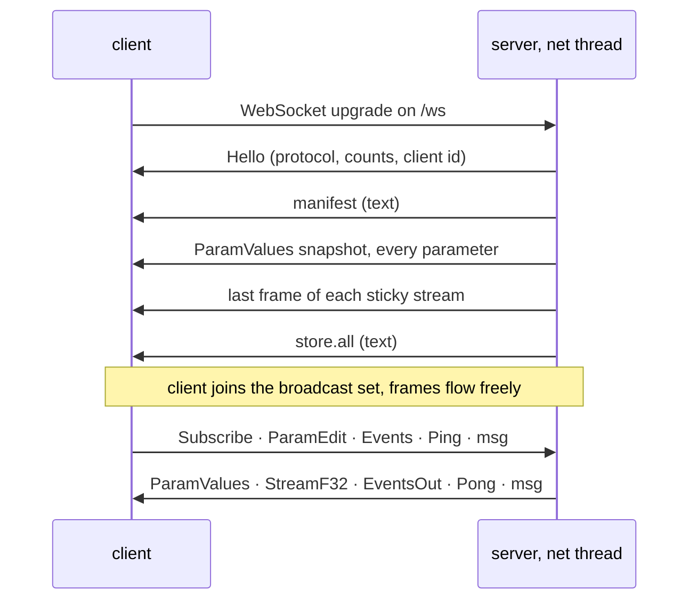

# noob-vst-webgui-framework wire format (protocol 1)

This is the complete reference for what travels between a noob-vst-webgui-framework server
(the plug-in side, `noob-vst-webgui-framework`) and its clients (`@noob-audio-engineering/noob-vst-webgui-framework`, or any
WebSocket client). The Rust side of every frame is in
`crates/noob-vst-webgui-framework/src/wire.rs`; the browser side is in `crates/noob-vst-webgui-framework/web/noob-vst-webgui-framework.js`.
The two are kept in lockstep by hand; the integration tests in
`crates/noob-vst-webgui-framework/tests/server.rs` exercise every frame kind end to end.

## Overview

One WebSocket connection per UI client, on the loopback interface, at
`ws://127.0.0.1:<port>/ws`. Two kinds of WebSocket messages:

* **binary frames**: everything on the hot path (parameter values, edits,
  telemetry, events, latency probes). Fixed little-endian layouts, decoded
  with a `DataView`; float arrays land on 4-byte boundaries so the browser
  wraps them in a `Float32Array` without copying.
* **text frames**: JSON for the control plane (the manifest at connect time,
  the UI store, ad-hoc messages in either direction).

Why not protobuf: the telemetry hot path is arrays of `f32` at up to audio
block rate. A fixed layout makes the browser side a zero-copy view; protobuf
would varint-decode every value. The control plane is small and rare, so JSON
costs nothing there and needs no code generation on either side.

There is no authentication: the server binds `127.0.0.1` only, and anything
that can open a loopback socket is trusted. Never bind another address.

## Binary frames

### Header

Every binary frame starts with the same 4-byte header:

| offset | size | field | meaning |
|---|---|---|---|
| 0 | `u8` | `kind` | frame kind, table below |
| 1 | `u8` | `flags` | frame-level flags; reserved, always `0` in protocol 1, ignored by decoders |
| 2 | `u16` | `arg` | kind specific: the entry count of a batch, or the stream index |
| 4 | … | payload | kind specific, below |

All integers and floats are **little-endian**. `f32` and `f64` are IEEE 754.
A decoder that sees an unknown `kind` should drop the frame; the Rust
decoder returns `WireError::UnknownKind` and the server logs it and carries
on.

### Kinds

| kind | name | direction | `arg` | payload size |
|---|---|---|---|---|
| `0x01` | Hello | server → client | 0 | 8 |
| `0x10` | ParamValues | server → client | entry count | 8 × count |
| `0x11` | ParamEdit | client → server | entry count | 8 × count |
| `0x12` | Events | client → server | entry count | 12 × count |
| `0x13` | EventsOut | server → client | entry count | 12 × count |
| `0x20` | StreamF32 | server → client | stream index | 16 + 4 × len |
| `0x21` | StreamU8 | server → client | stream index | 16 + len |
| `0x30` | Ping | client → server | 0 | 8 |
| `0x31` | Pong | server → client | 0 | 16 |
| `0x40` | Subscribe | client → server | stream index | 8 |

Frames sent in the wrong direction are ignored (the server only acts on
ParamEdit, Events, Ping and Subscribe).

### Hello (`0x01`)

The first binary frame after connect. 12 bytes in total.

| offset | size | field |
|---|---|---|
| 4 | `u16` | `protocol`: the server's protocol version (`1`) |
| 6 | `u16` | `param_count` |
| 8 | `u16` | `stream_count` |
| 10 | `u16` | `client_id`: this connection's id, never `0` |

A client whose protocol differs should disconnect. `client_id` is what the
server uses to mark echoes and to skip the originator of a `store.set`; a
client never sends it, the server already knows.

### ParamValues (`0x10`)

A batch of normalized parameter values, `arg` entries of 8 bytes each,
starting at offset 4:

| offset in entry | size | field |
|---|---|---|
| 0 | `u16` | `index`: dense parameter index (manifest order) |
| 2 | `u16` | `flags`, below |
| 4 | `f32` | `value`, normalized `0.0..=1.0` |

Entry flags:

| bit | name | meaning |
|---|---|---|
| `0x0001` | ECHO | this is the echo of an edit *this* client sent; use it to measure round-trip latency and to avoid fighting an ongoing drag |
| `0x0002` | HOST | the change came from the host (automation, preset load, another UI) rather than from a client |

Neither flag is set on the connect-time snapshot or on a resync snapshot.
When the server's `echo_edits` option is off, a client never receives its
own edits at all.

The same index may appear several times in one frame (a begin and a perform
of the same gesture); apply entries in order, the last one wins.

### ParamEdit (`0x11`)

A batch of edits from a client, `arg` entries of 8 bytes each, starting at
offset 4:

| offset in entry | size | field |
|---|---|---|
| 0 | `u16` | `index` |
| 2 | `u8` | `phase`: `0` begin, `1` perform, `2` end |
| 3 | `u8` | padding, `0` |
| 4 | `f32` | `value`, normalized; clamped by the server |

The phases mirror VST3 `beginEdit` / `performEdit` / `endEdit` so a host
records one automation gesture per drag. A one-shot change is sent as three
entries (begin, perform, end) in one frame. A frame with an invalid phase is
rejected as a whole (`WireError::BadPhase`); an unknown index is ignored
entry by entry.

The server applies each entry to the parameter store immediately on the
network thread (so the audio thread sees it on its next block), queues it
for the host or calls the edit hook, and fans it out to every client as a
`ParamValues` entry (ECHO to the sender, plain to the rest).

### Events (`0x12`) and EventsOut (`0x13`)

Notes, controllers and plug-in-defined signals, `arg` entries of 12 bytes
each, starting at offset 4. Both directions share the layout:

| offset in entry | size | field |
|---|---|---|
| 0 | `u8` | `kind`, table below |
| 1 | `u8` | `channel` |
| 2 | `u8` | `a`: note number, controller number, or plug-in-defined |
| 3 | `u8` | `b`: plug-in-defined |
| 4 | `f32` | `value`: velocity, amount, or plug-in-defined |
| 8 | `u32` | `offset`: sample offset within the current block (client → server: usually `0`; server → client: unused) |

| kind | name | `a` | `value` |
|---|---|---|---|
| `1` | NOTE_ON | note number | velocity `0..1` |
| `2` | NOTE_OFF | note number | release velocity |
| `3` | CONTROL | controller number | `0..1` |
| `4` | PITCH_BEND | – | `-1..1` |
| `5` | AFTERTOUCH | note (`0` = channel pressure) | `0..1` |
| `6` | PROGRAM | program number | – |
| `≥ 0x80` | plug-in-defined | anything | anything |

Client → server events land in a lock-free queue the audio thread drains
once per block (`AudioHandle::drain_events`); a full queue (1024 events)
drops the event. Server → client events come from `AudioHandle::send_event`
or `NoobVstWebguiFramework::push_event`, are batched (up to 512 per frame) and delivered in
order. If a client's outbound queue is full the events frame is dropped for
that client and a full parameter snapshot is scheduled instead; a UI that
tracks transient state from events (lit keys) should treat a snapshot as a
hint to re-check it.

### StreamF32 (`0x20`) and StreamU8 (`0x21`)

One frame of telemetry for the stream whose index is `arg`:

| offset | size | field |
|---|---|---|
| 4 | `u32` | `seq`: publish counter of the stream, starting at `1`, wrapping; gaps mean skipped frames |
| 8 | `u64` | `ts_ns`: publish time, nanoseconds since the bridge was created |
| 16 | `u32` | `len`: number of values (F32) or bytes (U8) that follow |
| 20 | … | `len × f32`, or `len` bytes |

The data starts at offset 20, a multiple of four, so a browser can do
`new Float32Array(buffer, 20, len)` without copying. A frame is never longer
than the stream's declared `capacity`, and may be shorter. Bytes after
`len` values are ignored.

`StreamU8` is reserved for opaque per-stream bytes; the server currently
publishes only `StreamF32`.

### Ping (`0x30`) and Pong (`0x31`)

| frame | offset | size | field |
|---|---|---|---|
| Ping | 4 | `f64` | `client_time`: any clock the client likes; echoed back untouched |
| Pong | 4 | `f64` | `client_time`: as received |
| Pong | 12 | `f64` | `server_time_us`: microseconds since the bridge was created (the clock `ts_ns` uses, in different units) |

The server answers on the socket task, ahead of anything queued by the
pump, so a Pong measures transport latency rather than pump backlog. The
browser client sends one every `pingIntervalMs` and reports the round trip
as `rttMs`.

### Subscribe (`0x40`)

Per-client, per-stream rate limit for the stream whose index is `arg`:

| offset | size | field |
|---|---|---|
| 4 | `u32` | `min_interval_us`: minimum time between frames to this client, `0` = every frame |
| 8 | `u8` | `enabled`: `0` off, anything else on |
| 9 | 3 bytes | padding |

Every stream starts enabled with no throttle. A throttled stream still
delivers the *newest* frame whenever the interval has elapsed (frames are
not queued, so nothing goes stale). A disabled stream costs nothing on the
server side: the frame is encoded once for everyone and simply not sent to
that client. An unknown stream index is ignored.

## Connect sequence

1. **Hello** (binary).
2. **manifest** (text, below).
3. **ParamValues** with every parameter, no flags (binary).
4. the latest frame of every **sticky** stream (binary), so state-like data
   that is only published on change (a response curve, a wavetable) is
   present immediately.
5. **`store.all`** (text): the UI store, so the page can hydrate before it
   renders.



Only then is the client added to the broadcast set; nothing published
during the handshake is lost because the snapshot and the sticky frames are
taken after the connection is up. From here on frames flow freely.

Delivery guarantees per kind:

* **ParamValues** and **EventsOut** are never dropped silently. If a
  client's outbound queue (256 messages by default) is full, the frame is
  skipped and the client is flagged; on the next pump cycle it receives a
  full `ParamValues` snapshot of every parameter, so it can never drift.
* **StreamF32** frames are disposable: a full queue just skips that frame
  for that client.
* **Text** frames are never dropped by the pump (the outbound text queue is
  unbounded), but a full client queue drops them at the socket.

## Text frames

Every text frame is a JSON object with a `t` field.

### Manifest (`"t": "manifest"`)

Sent once, second in the connect sequence. Everything a UI needs to render
controls without knowing the plug-in:

```json
{
  "t": "manifest",
  "name": "noob-q",
  "protocol": 1,
  "meta": { "vendor": "Ely Erin Fox", "sample_rate": 48000, "bands": 24 },
  "params": [
    {
      "index": 0, "id": "bypass", "name": "Bypass", "unit": "", "group": "global",
      "min": 0, "max": 1, "default": 0, "default_norm": 0,
      "taper": "linear", "steps": 2, "labels": [], "automatable": true,
      "table": [0, 0.0156, "... 65 points ..."]
    }
  ],
  "streams": [
    { "index": 0, "id": "spectrum_pre", "name": "Input Spectrum", "kind": "spectrum",
      "capacity": 1025, "channels": 1, "sticky": false,
      "meta": { "sample_rate": 48000, "fft_size": 2048, "db": true } }
  ]
}
```

Top level:

| field | type | meaning |
|---|---|---|
| `name` | string | the bridge name (`NoobVstWebguiFramework::builder(name)`) |
| `protocol` | integer | wire protocol version, same as in Hello |
| `meta` | any JSON | free-form, set with `NoobVstWebguiFrameworkBuilder::meta`; the plug-ins put `vendor`, `version`, `sample_rate`, layout hints and a `standalone` flag there |
| `params` | array | one entry per parameter, in index order |
| `streams` | array | one entry per stream, in index order |

Each parameter:

| field | type | meaning |
|---|---|---|
| `index` | integer | the `u16` used in binary frames |
| `id` | string | stable identifier; what a page looks parameters up by |
| `name` | string | display name |
| `unit` | string | display suffix (`"Hz"`, `"dB"`), may be empty |
| `group` | string | free-form grouping for layout, may be empty |
| `min`, `max` | number | plain values at normalized `0` and `1` |
| `default` | number | default in plain units |
| `default_norm` | number | default in normalized units |
| `taper` | string | `linear`, `log`, `skew` or `table` |
| `skew` | number | present only when `taper` is `skew`: the skew factor |
| `steps` | integer | `0` continuous, otherwise the number of discrete steps (`2` = toggle); discrete values snap |
| `labels` | array of strings | names of the steps for enum-style parameters, else empty |
| `automatable` | boolean | advisory: whether hosts may automate it |
| `table` | array of 65 numbers | the normalized → plain mapping sampled at `i / 64`, so a UI can draw a correct scale and format values for any taper, including ones it has no formula for (this is how nih-plug parameters are mirrored) |

Each stream:

| field | type | meaning |
|---|---|---|
| `index` | integer | the `arg` of its binary frames |
| `id` | string | stable identifier |
| `name` | string | display name |
| `kind` | string | `meter`, `spectrum`, `waveform`, `curve` or `raw`; a hint only |
| `capacity` | integer | maximum values per frame |
| `channels` | integer | interleaved channel count |
| `meta` | any JSON | free-form (sample rate, FFT size, dB range, …) |
| `sticky` | boolean | the last frame is replayed to late clients |

Unknown fields must be ignored; new ones may be added without a protocol
bump.

### Messages (`"t": "msg"`)

Ad-hoc messages, either direction:

```json
{ "t": "msg", "topic": "preset", "data": { "name": "Init" } }
```

| field | type | meaning |
|---|---|---|
| `topic` | string | routing key; the plug-in and the page agree on the set |
| `data` | any JSON | payload; `null` when absent |

Server → client messages are broadcast to every client (`NoobVstWebguiFramework::send_json`)
or, for store changes, to every client but the originator. Client → server
messages are queued for the plug-in (`NoobVstWebguiFramework::poll_message`, which also
reports the sending client's id); the queue holds 1024 messages and drops
the oldest when full. Text that is not valid JSON, or has no `"t": "msg"`,
is logged and ignored.

### Reserved topics: the UI store

The plug-in owns a small JSON object, the *UI store*, for page state that
should travel with the plug-in rather than with the browser profile: user
presets, favourites, view settings. The nih-plug adapter saves it inside the
host's plug-in state (`StoreSlot`); standalones keep it in a file
(`FileStore`). Every client of an instance sees the same store. The server
handles these topics itself; a plug-in never sees them:

| topic | direction | data |
|---|---|---|
| `store.all` | server → client, once at the end of the connect sequence, after the plug-in replaces the store (state restore), and in answer to a client `store.all` | `{ "values": { key: any, ... } }`, the whole store |
| `store.all` | client → server | none; asks for the whole store again |
| `store.set` | client → server | `{ "key": string, "value": any }`; `null` removes the key |
| `store.changed` | server → every *other* client, or every client when the plug-in changed a key | `{ "key": string, "value": any }` |
| `store.error` | server → the sender | `{ "key": string, "error": string }` |

Limits, enforced on every `store.set`: a key is 1 to 128 bytes; one value is
at most 256 KiB serialized; the whole store is at most 1 MiB serialized.
The errors are `bad key`, `value too large` and `store full`. A rejected
value is not stored and nobody else hears about it.

In the browser: `client.store.get(key, dflt)`, `client.store.set(key, value)`,
`client.store.on(key | '*', fn)`, `client.store.ready`. With Vue,
`useStore()` and `useStoredRef(key, dflt)`.

### Conventions used by the adapter and the plug-ins

These are ordinary messages, not part of the protocol; they are listed so
a new plug-in can reuse them.

| topic | direction | data | who handles it |
|---|---|---|---|
| `resize` | client → server | `{ "width": w, "height": h }` | the nih-plug adapter: asks the host to resize the editor and resizes the web view; standalones ignore it |
| `fullscreen` | client → server | `{ "on": bool, "width"?, "height"? }` | the nih-plug adapter: on, resizes the editor to the monitor's work area (the page's `screen.availWidth/Height` is the fallback) and keeps the previous size; off, restores it. Standalones ignore it (a tab uses the Fullscreen API itself) |
| `store` key `window` | written by the adapter | `{ "width": w, "height": h }` | the last size the page asked for with `resize` or the host set by resizing the window; the editor reopens at it (not written for fullscreen sizes) |
| `reset` | client → server | none | the plug-ins' standalones: every parameter back to its default |
| `status` | server → client, about once a second | free-form (`clients`, `blocks`, `edits`, `dropped`, `sample_rate`, latency) | the plug-ins' pages show it in their status line |
| `sample_rate` | server → client | `{ "sample_rate": hz }` | the Vue layer patches `manifest.meta.sample_rate` |

## HTTP endpoints

Besides `/ws`:

* `GET /instance` → `{ "name", "pid", "port", "url", "started", "protocol" }`
  for this server (`started` is Unix seconds). Used by discovery to validate
  records.
* `GET /instances` → that record for every live instance of the **same
  plug-in** (same `name`) on the machine; `?all=1` returns every instance
  regardless of name. Instance features are scoped to one product on
  purpose. Each server writes `<pid>-<port>.json` to the discovery directory
  on start and removes it on stop; records whose server does not answer
  `/instance` within 500 ms, or answers with another pid, are deleted. The
  directory is `%LOCALAPPDATA%\noob-vst-webgui-framework\instances` on Windows,
  `~/Library/Application Support/noob-vst-webgui-framework/instances` on macOS and
  `$XDG_RUNTIME_DIR/noob-vst-webgui-framework/instances` (else `~/.local/state/noob-vst-webgui-framework/instances`)
  on Linux. `node tools/instances.mjs` does the same scan from the shell.
* `GET /noob-vst-webgui-framework/<file>` → the browser library baked into the server
  (`noob-vst-webgui-framework.js`, `components/*.js`), so a page can `import` it without a
  bundler.
* anything else → the configured assets (`Assets::Dir`, `Assets::Embedded`
  or `Assets::Lookup`). `/` and any path ending in `/` map to `index.html`;
  paths containing `..`, `\` or `:` are refused with `400`. With
  `Assets::None`, `/` shows a placeholder page. Every response carries
  `Cache-Control: no-store` and a content type from the extension.

## Ports

A server binds `127.0.0.1` under one of three policies: a **fixed** port
(fails if taken), an **ephemeral** one (`0`, the OS chooses), or **probe**:
try `base`, `base+1`, … `base+span-1` and take the first free one, falling
back to an ephemeral port if all are busy. Plug-ins default to probing a
range derived from the plug-in name (`PortPolicy::for_name`: FNV-1a of the
name into 49152–64151, span 64), so instances never collide and an instance
usually gets the same origin next session, which keeps the browser's own
storage attached to it. Standalones prefer their documented port (4242,
4243) and walk up from there; `--port N` insists on `N`.

## Timing

* `ts_ns` on stream frames and `server_time_us` on Pong are from the same
  monotonic clock, started when the bridge was created.
* Streams are *latest wins*: the audio thread writes into a triple buffer;
  if the pump is behind, intermediate frames are dropped, never queued.
  `seq` increments per published frame, so gaps are visible.
* Per-client Subscribe throttles or disables a stream server-side, so a
  hidden panel costs nothing.
* Parameter changes are batched per pump cycle (up to 4096 per frame); the
  pump wakes as soon as anything is published, so a batch normally holds
  whatever arrived during the previous encode, a few entries at most.

## Threads (server side)

```
audio thread ──(atomics / triple buffers, wait-free)──► pump thread ──(try_send)──► per-client writer task ──► socket
socket ──► per-client reader task ──(atomics + lock-free queues)──► audio thread / host
```

The audio thread never allocates, locks or blocks. It optionally `unpark`s
the pump thread after a publish (one atomic swap plus, only if the pump is
asleep, a lightweight wake syscall); `WakeMode::Poll` avoids even that.
Inbound frames are decoded and applied on the socket task itself, with no
intermediate queue, which is why an edit reaches the parameter store within
microseconds of arriving.

## Versioning

* The protocol version appears in Hello, in the manifest and in `/instance`.
  Both ends currently speak version `1`.
* Within a version: new frame kinds, new entry flags, new event kinds, new
  manifest fields and new message topics may be added; receivers ignore what
  they do not know. Existing byte layouts, flag bits and the connect
  sequence never change.
* Any change to an existing binary layout, to the meaning of a flag, or to
  the connect sequence bumps `PROTOCOL_VERSION`; a client that sees a
  different version in Hello should disconnect and report it.

## Limits (defaults)

| what | value | where |
|---|---|---|
| plug-in → UI change queue | 4096 entries | `NoobVstWebguiFrameworkBuilder::ui_queue` |
| UI → host edit queue | 1024 entries | `NoobVstWebguiFrameworkBuilder::host_queue` |
| event queues, each direction | 1024 events | fixed |
| inbound message queue | 1024 messages, oldest dropped | fixed |
| per-client outbound queue | 256 messages | `ServerConfig::send_queue` |
| largest inbound WebSocket message | 1 MiB | `ServerConfig::max_message_size` |
| UI store | 128-byte keys, 256 KiB values, 1 MiB total | fixed |
| parameters, streams | 65535 each | `u16` indices |
