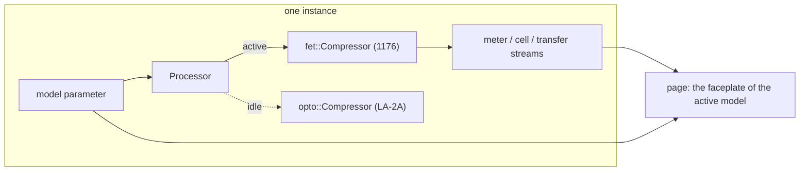

# Noob CompressorLab

Two classic compressors in one plug-in, built on vst3-web-stratum. Each instance is set to one
model, the **1176** (a feedback FET compressor) or the **LA-2A** (an optical leveling amplifier),
and the page draws the matching faceplate: the 1176 with its three looks across nine revisions, the
LA-2A with its big knobs, VU face and the T4 cell laid bare. Flip the model switch and the same
instance becomes the other box; the switch is a parameter, so a project remembers it.

Both are humorous, affectionate spoofs of hardware I admire, and of the plug-ins people have made
of it. They are not parity replacements: the models come from published measurements, schematics
and the literature (see [`research/1176.md`](research/1176.md) and
[`research/LA-2A.md`](research/LA-2A.md)), tuned until the test plan in each research document
passes, and no further.

This example is never published. It shows what a product-sized plug-in looks like on the
framework: the DSP, the standalone, the plug-in and the page all speak the same parameter and stream
layout, and everything that is *not* about compressing audio (the bridge, server, host adapter,
browser client, gestures, needle ballistics and charts) comes from vst3-web-stratum.

## Layout

| path | what |
|---|---|
| `src/dsp/mod.rs` | the lab: `Model`, `Settings`, the parameter ids and specs, the streams, the `Processor` that hosts both engines and switches between them |
| `src/dsp/fet/` | the 1176: the oversampled feedback FET model, its revisions, knob maps and tests |
| `src/dsp/opto/` | the LA-2A: the T4 cell model, sidechain and tube stage, and its tests |
| `src/dsp/source.rs` | the standalone's demo signals (vocal, bass, drums, noises, tones) |
| `src/dsp/tests.rs` | tests of the lab itself: the contract, the switch, the telemetry |
| `src/plugin.rs` | the nih-plug VST3 / CLAP plug-in (feature `plugin`) |
| `src/bin/standalone.rs` | the dev server with a fake audio thread |
| `web/` | the Vue + Tailwind page, one view per model ([its README](web/README.md)) |
| `research/` | how the originals work and how they are simulated |



## Build, run, test

```sh
# the page
cd examples/noob-compressorlab/web && npm install && npm run build && cd -

# standalone: demo sources through the active model, page on port 4244 (or the next free one)
cargo run -p noob-compressorlab --bin noob-compressorlab-standalone -- --open

# hot reload against the running standalone (proxies /ws and /instance* to it)
cd examples/noob-compressorlab/web && npm run dev

# the plug-in (embeds web/dist)
cargo build --release -p noob-compressorlab --lib --features plugin

# the test plan of both models plus the lab's own tests
cargo test -p noob-compressorlab
```

## The model switch

`model` is a non-automatable parameter of the instance (`1176` or `LA-2A`, default `1176`). The
`Processor` owns both engines; only the active one runs. When the switch flips, the engine that
becomes active starts from rest and takes over through a 20 ms crossfade while the outgoing engine
keeps running, so the change does not click. The active model's latency (the 1176's 2x
oversampler, 15 samples; the LA-2A has none) is reported to the host and updated on a switch. The
transfer curve is republished for the new model, and the `cell` stream is zeroed once when the
1176 takes over.

Every knob of both models is a parameter, so a project saves the whole lab. The 1176's parameters
are prefixed `fet_`, the LA-2A's `opto_`; the four both share (`link`, `mix`, `sc_hpf`, `bypass`)
apply to whichever engine is active.

## Parameters

| id | range / labels | default | group | automatable |
|---|---|---|---|---|
| `model` | 1176, LA-2A | 1176 | lab | no |
| `fet_input` | 0..48 mark (= −48..0 dB) | 24 | 1176 | yes |
| `fet_output` | 0..48 mark | 24 | 1176 | yes |
| `fet_attack` | 0 (OFF)..7 | 4 | 1176 | yes |
| `fet_release` | 1..7 | 4 | 1176 | yes |
| `fet_ratio` | 4, 8, 12, 20, All | 4 | 1176 | yes |
| `fet_meter` | GR, +4, +8, Off | GR | 1176 | no |
| `fet_revision` | A, B, C, D, E, F, G, H, LN | LN | 1176 | no |
| `opto_gain` | 0..100 (unity at 32, +40 dB at 100) | 32 | LA-2A | yes |
| `opto_peak_reduction` | 0..100 | 40 | LA-2A | yes |
| `opto_mode` | Compress, Limit | Compress | LA-2A | yes |
| `opto_meter` | Gain Reduction, Output +10, Output +4 | Gain Reduction | LA-2A | no |
| `opto_emphasis` | 0..1 (R37) | 1 | LA-2A | yes |
| `opto_cell` | Silver, Gray, LA-2 | Gray | LA-2A | no |
| `link` | toggle | on | extras | yes |
| `mix` | 0..100 % | 100 | extras | yes |
| `sc_hpf` | 0 (off)..300 Hz | 0 | extras | yes |
| `bypass` | toggle | off | extras | yes |
| `src_kind` | Vocal, Bass, Drums, Pink noise, White noise, Saw, Sine | Vocal | source (standalone only) | no |
| `src_level` | 0..1 | 0.4 | source | no |
| `src_freq` | 20..20000 Hz, log | 110 | source | no |

The 1176's Input and Output marks are attenuation from fully clockwise: mark `m` is `m − 48` dB,
so 24 / 24 is unity. Attack marks 1..7 map geometrically to 800..20 µs, Release marks to
1100..50 ms, and 0 on Attack is the OFF detent. The LA-2A's Peak Reduction is a sidechain drive
calibrated so 30 gives 1 dB of reduction at 0 VU.

## Streams

| id | kind | values | rate | contents |
|---|---|---|---|---|
| `meter` | meter | 6 | every block | `[in_l, in_r, out_l, out_r, gr_db, meter_vu]`: linear peaks (1.0 = 0 dBFS), the gain change in dB (≤ 0 for both models), and what the active model's panel meter reads in dB |
| `cell` | raw | 3 | every block while the LA-2A is active | `[light, free_carriers, trapped_carriers]`, 0..1 |
| `transfer` | curve, sticky | 128 | on change | the active model's static output level in dBFS for a sine at −60..0 dBFS |

`meter_vu` follows the active model's meter switch. In the GR modes it equals `gr_db`, so the
needle rests at 0 and swings left. In the output modes it is the VU reading of the block's mean
rectified output against 0 VU = −18 dBFS (the `+4` positions of both meters, `vu_ref_dbfs` in the
manifest); the 1176's `+8` reads 4 dB lower and the LA-2A's `Output +10` 6 dB lower; the 1176's
`Off` rests the needle at −60.

## The 1176

A voltage-domain **feedback** compressor: the sidechain is fed from the preamp output, a
single-capacitor diode detector whose diode bias *is* the threshold, a FET control law with a
linear-then-saturating dB-per-volt curve, the FET divider with a signal-dependent (second- and
third-order) resistance, preamp and line-amp soft saturation, an output-transformer high-pass, the
"all buttons in" operating point and stereo linking, all at 2x oversampling. Section 7 of
[`research/1176.md`](research/1176.md) has the equations; `src/dsp/fet/compressor.rs` the
constants that were tuned against the tests.

### Revisions

`fet_revision` selects a circuit and, on the page, a faceplate look. Revisions that share a circuit
share constants (C = D = E, G = H). LN is the default: it is the unit still made, the one the
measurements I lean on were taken from, and it shares the C / D / E circuit, so the default sound is
the classic black face either way.

| revision | years | look | circuit |
|---|---|---|---|
| A | 1967 | Bluestripe (silver, blue meter block) | FET preamp, no low-noise circuit: noisiest, most second harmonic |
| B | 1967 to 1970 | Bluestripe | bipolar preamp, still no LN circuit |
| C | 1970 | Blackface | the LN circuit as a potted module |
| D | to 1973 | Blackface | the LN circuit on the main board; the reference black face |
| E | 1973 | Blackface | D with a switchable mains transformer; identical sound |
| F | 1973 on | Blackface | push-pull class-AB output stage and a new output transformer; lowest THD |
| G | later | Blackface | electronically balanced input replaces the input transformer |
| H | later | Silverface | cosmetic only: the G circuit |
| LN | the reissue | Blackface | C / D / E with a modern noise floor |

The measured THD at 10 dB of reduction, from the test plan:

| A | B | C/D/E | F | G/H | LN |
|---|---|---|---|---|---|
| 1.58 % | 1.21 % | 0.24 % | 0.19 % | 0.19 % | 0.24 % |

## The LA-2A

A grey-box model of the optical leveling amplifier: the T4 cell as an electroluminescent panel
driving a CdS photocell with trapped carriers (the slow, memory-laden second release stage), a
sidechain whose Peak Reduction drives the panel, the R37 emphasis shelf, the feedback / feed-forward
share that makes Limit differ from Compress, and a gentle tube stage. Section 7 of
[`research/LA-2A.md`](research/LA-2A.md) has the derivation; `src/dsp/opto/model.rs` the constants.
The three `opto_cell` variants scale the cell's speed (Silver 0.7, Gray 1.0, LA-2 1.6).

## Tests

`cargo test -p noob-compressorlab` runs 36 tests (one more is `#[ignore]`d and prints curves):

- **the lab** (`src/dsp/tests.rs`): the parameter contract (ids, labels, defaults, stream layout);
  shared values reach both engines; each model compresses and reports `gr_db` ≤ 0 with the GR meter
  equal to it; the output meter modes read 0 VU at −18 dBFS on both models; switching models
  crossfades without a sample-to-sample jump and settles to the new model's steady state; forty
  switches back and forth stay finite; the transfer curve follows the active model; every demo
  source plays;
- **the 1176** (`src/dsp/fet/tests.rs`): ratios hold within 20 % above onset; 20:1 is nearly flat;
  the input knob drives compression and 24 / 24 is unity; attack and release follow the knobs; all
  buttons in raises the threshold, lags and distorts more; LN is clean and the blue stripes add
  second harmonic; every revision is bounded and ordered as the sources say; bypass is transparent
  and mix blends; numerically robust; sample-rate invariant; stereo link shares one detector; the
  meter reads GR and VU; the transfer curve matches the engine within a couple of dB; the
  oversampler round-trips at unity with the stated latency;
- **the LA-2A** (`src/dsp/opto/tests.rs`): bypass is transparent and the tube stage clean; steady
  reduction follows Peak Reduction and level; ratio and knee differ between Compress and Limit;
  attack is about ten milliseconds and level dependent; release has two stages; the cell remembers
  long hard compression; highs get more reduction and R37 shapes the lows; distortion under
  reduction is odd and modest; stereo link shares one cell; numerical hygiene; sample-rate
  independent; the transfer curve is monotonic and matches the solver; make-up is unity at 32 and
  +40 dB at full; the meter reads the reduction and the output.

## Presets and the UI store

The page keeps its presets (per model) and the window size in the UI store. The standalone
persists the store in a file through the framework's `FileStore`; the plug-in saves the same data
inside its host state through a `StoreSlot`, so a project reopens with the presets and the window
the instance had.

## Page

The page is one Vite SPA with a shared shell (model switch, presets, fullscreen, edit-echo
read-out, bypass) and one view per model; see [`web/README.md`](web/README.md) for the looks, the
components, the dev manifest that lets the page render without a plug-in, and window sizing.

## Further reading

- [`research/1176.md`](research/1176.md): how the 1176 works and how it is simulated, with sources.
- [`research/LA-2A.md`](research/LA-2A.md): the same for the LA-2A.
- The framework's [guide](../../docs/README.md) for the bridge, streams, store and host adapter
  this example is built on.
