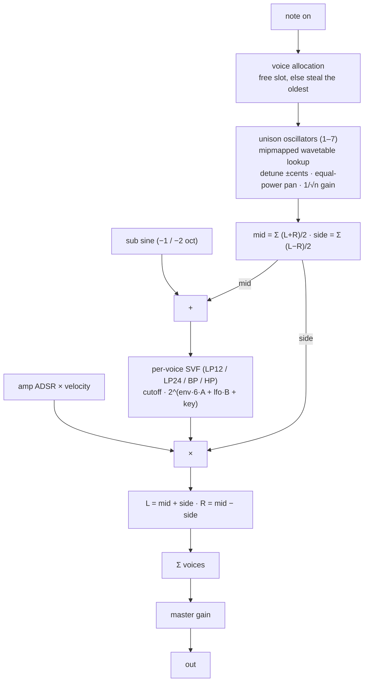

# Noob-Wave

> **About this example.** I wrote Noob-Wave as a humorous, affectionate spoof
> of the wavetable synths that shaped the genre, whose designs inspired it. It
> exists to exercise vst3-web-stratum with an instrument. It is my tribute to
> work I admire, not a parity replacement for any product, and I do not
> publish it.

A simple wavetable synthesizer, the second example of
[vst3-web-stratum](../../README.md).

It is an *instrument*: notes come from the host as MIDI (sample accurate),
or from the browser's on-screen keyboard as vst3-web-stratum event frames; audio goes
out in stereo. The plug-in window is the operating system's web view showing
a Vue 3 + Tailwind single-page app, and the sound engine publishes scope,
spectrum, voice and modulation telemetry straight from the audio thread. As
with every example in this repository, the *specifics* (the engine, the 35
parameters, the six streams, the page) live here; everything generic lives
in the framework crates.

| | |
|---|---|
| Formats | VST3 and CLAP (nih-plug), plus a standalone binary with real audio output |
| Editor | WebView2 (Windows), WKWebView (macOS), WebKitGTK (Linux) embedded in the host's window; falls back to the system browser |
| Engine | 16 voices, 7-voice unison, sine sub, TPT state-variable filter, two ADSRs, one LFO, six mipmapped factory wavetables |
| Telemetry | scope, spectrum, meter, per-voice state, modulation, wavetable preview |
| UI | `web/` — Vue 3 + Tailwind v4 + Vite 7 on top of `@elyerinfox/vst3-web-stratum/vue` |

## Layout

```
examples/noob-wave/
├── src/
│   ├── lib.rs               crate docs, plug-in entry points (feature `plugin`)
│   ├── dsp/
│   │   ├── mod.rs           parameter ids, stream ids, bridge builder, telemetry
│   │   ├── wavetable.rs     mipmapped tables from harmonic spectra (rustfft)
│   │   ├── synth.rs         voices, unison, sub, glide, bend; Settings; render()
│   │   ├── filter.rs        TPT state-variable filter, LP12 / LP24 / BP / HP
│   │   ├── env.rs           ADSR
│   │   └── lfo.rs           LFO with five shapes
│   ├── plugin.rs            nih-plug instrument: parameters, MIDI, editor, store
│   └── bin/standalone.rs    cpal output + bridge server, no DAW needed
├── web/                     the SPA (see web/README.md)
└── Cargo.toml               features: `plugin` (nih-plug, vst3-web-stratum-nih, include_dir)
```

The Rust API is documented in full; run `cargo doc -p noob-wave --features
plugin --open` for the rendered version.

## Quick start

### Run it without a DAW

```sh
# 1. build the page once (or keep `npm run dev` running, see below)
cd examples/noob-wave/web && npm install && npm run build && cd ../../..

# 2. run the standalone: default audio device, server on 4243 (or the next free port)
cargo run -p noob-wave --bin noob-wave-standalone -- --open
```

Flags:

| flag | effect |
|---|---|
| `--port N`, `-p N` | insist on port `N` (fails if it is taken); default: probe from 4243 upwards |
| `--open`, `-o` | open the page in the system browser once the server is up |
| `--dir path`, `-d path` | serve the page from `path` instead of `web/dist` |
| `--silent` | do not open an audio device; the engine still runs, paced to real time, so the UI works |
| `-h`, `--help` | usage |

The binary prints the page URL, the WebSocket URL, where the UI store file
lives and the audio device it opened. If `web/dist` is missing it says how
to build it.

### Hot reload while working on the page

```sh
cd examples/noob-wave/web
VST3_WEB_STRATUM_PORT=4243 npm run dev      # Vite serves the page, proxies /ws and /instance* to the standalone
```

### Build the plug-in

The `plugin` feature pulls nih-plug from git and embeds `web/dist` into the
binary, so build the page first.

```sh
cd examples/noob-wave/web && npm run build && cd ../../..
cargo build -p noob-wave --features plugin --release   # → target/release/noob_wave.dll / .so / .dylib
```

Wrap it into `.vst3` / `.clap` bundles with nih-plug's bundler; the root
README's *Build the plug-ins* section has the commands. Note that on
Windows a running `noob-wave-standalone.exe` holds the build directory's
lock: stop it before rebuilding.

## Playing it

* **Mouse / touch**: press and glide across the on-screen keyboard.
* **Computer keyboard** (when the page has focus):

  ```
  black:   w e   t y u   o p
  white:  a s d f g h j k l ; '
           C D E F G A B C D E F
  ```

  `a` is the keyboard's lowest visible C; `z` / `x` shift the QWERTY range
  down / up an octave (the `− oct` / `+ oct` buttons do the same). Velocity
  is fixed at 0.8 for mouse and QWERTY notes.
* **Host MIDI** (plug-in only): notes with velocity, pitch bend (±2
  semitones), CC 120 / 123 (all notes off). Host notes light the on-screen
  keys in yellow.
* **Pitch bend from the page** arrives as a vst3-web-stratum `PITCH_BEND` event
  (`-1..1` → ±2 semitones).

## Parameters

Ids are shared by the plug-in, the standalone and the page. Percent
parameters are exposed as 0–100 and used as 0–1 inside the engine. Choice
parameters carry their labels in the manifest and are stored as the label
index.

### `osc`

| id | name | range | default |
|---|---|---|---|
| `wt_table` | Wavetable | Basic Shapes, Harmonics, PWM, Formant, Digital, Bells | Basic Shapes |
| `wt_position` | Position | 0 – 1 | 0 |
| `osc_octave` | Octave | -3 – 3 | 0 |
| `osc_semi` | Semi | -12 – 12 | 0 |
| `osc_fine` | Fine | -100 – 100 ct | 0 |
| `unison_voices` | Unison | 1 – 7 | 1 |
| `unison_detune` | Detune | 0 – 100 ct (between the outermost voices) | 15 |
| `unison_width` | Width | 0 – 100 % | 50 |
| `osc_level` | Osc Level | 0 – 100 % | 80 |
| `osc_phase_random` | Random Phase | on / off | on |
| `sub_level` | Sub Level | 0 – 100 % | 0 |
| `sub_octave` | Sub Octave | -1 oct, -2 oct | -1 oct |

### `filter`

| id | name | range | default |
|---|---|---|---|
| `filter_mode` | Filter Type | LP 12, LP 24, BP, HP | LP 12 |
| `filter_cutoff` | Cutoff | 20 Hz – 20 kHz, log | 8 kHz |
| `filter_res` | Resonance | 0 – 100 % | 15 |
| `filter_env` | Env Amount | -100 – 100 % (±6 octaves) | 40 |
| `filter_key` | Key Track | 0 – 100 % | 50 |

### `amp` and `filt` (two ADSRs)

| id | name | range | default (amp) | default (filt) |
|---|---|---|---|---|
| `amp_attack` / `filt_attack` | Attack | 1 ms – 10 s, log | 5 ms | 5 ms |
| `amp_decay` / `filt_decay` | Decay | 1 ms – 10 s, log | 200 ms | 400 ms |
| `amp_sustain` / `filt_sustain` | Sustain | 0 – 100 % | 80 | 30 |
| `amp_release` / `filt_release` | Release | 1 ms – 10 s, log | 300 ms | 400 ms |

### `lfo`

| id | name | range | default |
|---|---|---|---|
| `lfo_rate` | LFO Rate | 0.02 – 20 Hz, log | 2 Hz |
| `lfo_shape` | LFO Shape | Sine, Triangle, Saw, Square, S&H | Sine |
| `lfo_pos` | LFO → Position | -100 – 100 % | 0 |
| `lfo_cutoff` | LFO → Cutoff | -4 – 4 oct | 0 |
| `lfo_pitch` | LFO → Pitch | -12 – 12 st | 0 |
| `lfo_retrig` | LFO Retrigger | on / off | off |

### `global`

| id | name | range | default |
|---|---|---|---|
| `vel_amp` | Velocity → Amp | 0 – 100 % | 70 |
| `glide` | Glide | 0 – 2 s | 0 |
| `master` | Master | -24 – 12 dB | -6 |
| `poly` | Voices | 1 – 16 | 8 |

## Streams

Published from the audio thread through vst3-web-stratum's wait-free triple buffers;
a slow page drops frames instead of building a backlog.

| id | kind | values | rate | contents |
|---|---|---|---|---|
| `scope` | waveform | 512 | every 2nd block | the most recent mono output samples |
| `spectrum` | spectrum | 1025 | every 2nd block | dBFS magnitudes of a 2048-point Hann FFT of the mono output (0 dB = full-scale sine) |
| `meter_out` | meter, 2 ch | 4 | every block | `peak L, peak R, rms L, rms R`, linear |
| `voices` | raw | 32 | every block | `level[16]` (envelope × velocity) then `note[16]` (`-1` = idle) |
| `modulation` | raw | 2 | every block | wavetable position after LFO, LFO value |
| `wavetable` | raw, **sticky** | 8192 | when the table changes | 32 frames × 256 samples of the selected table, for the 3-D view; late clients get the last frame on connect |

A "block" is the host's buffer in the plug-in and the cpal callback's buffer
(rendered in pieces of at most 4096 frames) in the standalone.

## DSP architecture


  samples per table, each in 9 band-limited mip levels (level *m* keeps
  the first `1024 >> m` harmonics). Factory tables are defined as harmonic
  spectra and rendered with an inverse FFT, so the mip levels are exact.
  Playback picks the level whose top harmonic stays below Nyquist for the
  note (evaluated for the highest detuned unison voice) and interpolates
  linearly in phase and between the two frames around the morph position.
  All six tables are built once when the synth is created, off the audio
  thread.
* **Voices** (`dsp/synth.rs`): 16 slots. Rendering runs in control-rate
  chunks of 16 samples: the LFO advances, every voice's pitch (glide,
  tuning, LFO, bend), unison increments and pans, mip level, sub increment
  and filter coefficients are refreshed, then the chunk is rendered at
  audio rate. A voice frees itself when its amplitude envelope goes idle.
  Stealing is hard (restart from silence).
* **Filter** (`dsp/filter.rs`): Simper's topology-preserving state-variable
  filter, 12 dB/oct per stage; `LP 24` cascades two stages (the second with
  70 % of the resonance). Resonance 0–1 maps to Q 0.5–50.
* **Envelopes** (`dsp/env.rs`): linear attack, exponential decay and
  release (within 0.7 % of the target in the stated time); release starts
  from wherever the envelope is, so early note-offs do not click.
* **LFO** (`dsp/lfo.rs`): sine, triangle, saw, square, sample-and-hold;
  free-running or retriggered per note.
* **Telemetry** (`dsp/mod.rs`): a 4096-sample ring feeds both the scope and
  a Hann-windowed 2048-point FFT; the meter accumulates peak and RMS per
  block.

Everything after construction is real-time safe: no allocation, no locks,
no I/O on the audio thread. `Settings` is a plain `Copy` snapshot compared
by value, so both hosts rebuild it every block for free.

## Hosts

### Plug-in (`src/plugin.rs`)

* `NoobWaveParams` implements nih-plug's `Params` by hand so the ids match
  the standalone and the page. It also holds a `StoreSlot`, which saves the
  page's UI store inside the host's plug-in state through
  `serialize_fields` / `deserialize_fields`.
* `process()` drains the page's note events first (they carry no timing),
  then walks the host's events sample-accurately, rendering up to each
  one. Host notes are echoed to the page as events so the keyboard lights
  up. It returns `KeepAlive` while voices sound so the tail is not cut.
* The editor opens at 1080 × 640; the page can request another size with a
  `resize` message. `initialize` sends the page a `sample_rate` message.
* By default every instance probes a port range hashed from the plug-in
  name (see `PortPolicy::for_name` in `vst3-web-stratum`), so several instances
  coexist and each keeps a stable origin.

### Standalone (`src/bin/standalone.rs`)

* The cpal callback owns the engine; it is shared with the start-up code
  through a mutex that the callback only ever `try_lock`s, so the audio
  thread can never block (see the docs on `start_audio`). `f32`, `i16` and
  `u16` devices are supported; without a device, or with `--silent`, the
  engine runs on a paced thread.
* The main thread counts page edits, handles `reset` (every parameter back
  to default), sends a `status` message once a second and flushes the UI
  store to `<per-user data dir>/vst3-web-stratum/noob-wave.store.json` whenever a
  key changed (`FileStore`).
* The server prefers port 4243 and walks up from there; `--port N`
  insists.

## Presets and the UI store

Factory presets live in the page (`web/src/presets.js`): Init, Warm Pad,
Pluck, Sub Bass, Super Lead, Vowel Keys, Digital Bells, Sync Stab. Each is a
`{ id: plain value }` map; anything not listed loads at its default.

User presets are kept in the plug-in's **UI store** under the key
`presets.user` (`client.store` in the page, the `store.*` topics on the
wire). The plug-in persists the store with its state, the standalone in the
file above, and every window of an instance sees the same list. Nothing is
kept in the browser's `localStorage`.

Messages the page sends: `reset`, `resize { width, height }`. Messages it
receives: `status`, `sample_rate`.

## UI

The page is documented in [`web/README.md`](web/README.md). Component map:

| component | role |
|---|---|
| `Header.vue` | title and byline, undo / redo, A/B, preset stepper and name, voice count, connection and latency readout |
| `WavetablePanel.vue` | 3-D wavetable view (`wavetable` stream), table picker, position / level / sub, tuning, unison |
| `FilterPanel.vue` | mode buttons, response curve, cutoff / resonance / env amount / key tracking |
| `EnvPanel.vue` | amp and filter ADSR editors with draggable handles plus knobs |
| `LfoPanel.vue` | shape buttons, retrigger, rate and the three modulation amounts, live LFO indicator |
| `MasterPanel.vue` | velocity → amp, glide, voices, master, output meter and voice activity |
| `ScopePanel.vue` | output scope and spectrum |
| `KeyboardBar.vue` | on-screen keyboard, octave buttons, help text |
| `Section.vue` | the panel frame used by all of the above |
| `composables/useSynth.js` | grouped parameter handles, presets and UI state on top of `@elyerinfox/vst3-web-stratum/vue` |

## Tests and tools

```sh
cargo test -p noob-wave                  # 11 DSP tests: wavetables, filter, envelope, synth
node tools/play.mjs 4243 60 400          # play C4 for 400 ms headlessly and check the meter
node tools/bench.mjs 4243                # edit → echo and ping latency, stream rates
node tools/instances.mjs                 # every bridge instance on this machine
```

## Further reading

* [Root README](../../README.md) — the framework, both examples, latency figures.
* [`docs/WIRE.md`](../../docs/WIRE.md) — the wire format, the UI store topics, HTTP endpoints, port policy.
* [`docs/`](../../docs/) — the other guides.
* [`crates/vst3-web-stratum`](../../crates/vst3-web-stratum/) — the bridge and server this example is built on.
* [`crates/vst3-web-stratum-nih`](../../crates/vst3-web-stratum-nih/) — the nih-plug editor adapter and `StoreSlot`.
* [`web/README.md`](web/README.md) — the SPA.
